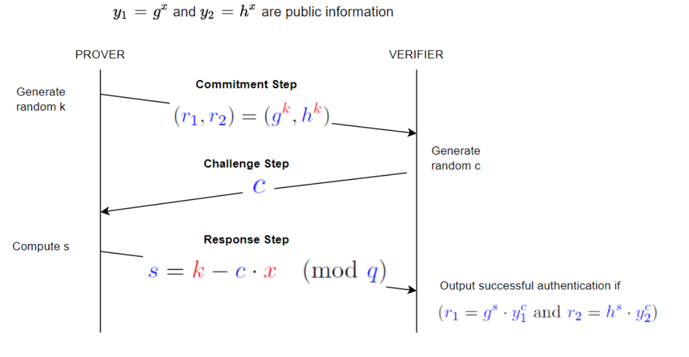
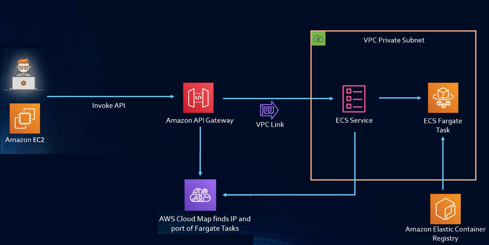

# The ZKP Protocol

## What will you learn with this demo?

- How to Implement the Zero Knowledge Protocol with a Client (Prover) and a Server (Verifier)
- How to Use Kafka with a publish/subscribe pattern to share the public data/keys
- How to Create a Rest Controller with 'Micronaut annotations'
- How to Create a GRPC Client/Server to establish communication between the Client and Server
- How to Create a Dockerfile for each component
- How to Create a Docker Compose with 4 containers (Client, Server, Kafka, Zookeeper)
- How to Call the containers within the same network
- How to Run it and test it locally
- How to Deploy and Run it on Amazon AWS ECS

## Two-phase protocol: Register and Authentication
==============================================

## Register Process
The prover (client) has a secret password x (i.e. it is a number) and wishes to register it with the verifier (server). To do that, they calculate y1 and y2 using public g and h and the secret x and send to the verifier y1, y2.

## Login/Authentication Process
The login process is done following the ZKP Protocol shown in the diagram. Been the Prover the authenticating party and the Verifier the server running the authentication check:  
 

## Tasks in hand

Design and write the code that implements the ZKP Protocol outlined above. The solution should be implemented as server and client using gRPC protocol according to the provided interface described in the “protobuf” schema. The code should implement very simple server and client applications. We would like to see how you are thinking about and approaching the problem, so a simple description of your approach and how you’d extend it or integrate would be helpful

# Instructions on how to run/deploy/test 

## Tech stack
- OpenJDK 17.0.1
- Maven 3.8.6
- Docker 20.10.21
- Docker-compose 2.13.0
- Micronaut 3.7.4
- GRPC 1.16.1
- Zookeeper/Kafka latest
 
## Components and composition
### Prover client
- Rest API
- Message-driven publisher/producer
- Grpc client
### Verifier server
- Grpc server
- Message-driven listener / consumer

## Workflow
- To call Grpc client API there is a Rest API which can be used to invoke the register and the login/Authentication processes.
- The public data/keys are sent to a Kafka topic to be consumed by consumer. 
- The register process works independently of the login/authentication process.

## Register process API

### HTTP1 POST/JSON register /zkp/register
#### body signature example
{
 "user" : "blopes",
 "number" : "12345"
}

This facilitator endpoint will be used to generate all the input data required to invoke the ZKP protocol register process. 

## Authentication process API

### HTTP1 GET login parameters: user and password 
#### Example: /zkp/login/blopes/101

# How to run

On your command line under the root folder run the following command:
- docker compose up -d

Four containers will be created
1) zookeeper 
2) kafka
3) zkpprover
4) zkpverifier

Kafka topic will be automatically created and ready to be used. 

# How to test
1) Use your favourite tool to execute an HTTP1 POST (curl, postman, etc) for the register endpoint  
Returned message in case of success: 
{
    "message": "Y1 and Y2 successfully registered in the server."
}

2) Use your favourite tool to execute a HTTP1 GET (curl, postman, etc) for the login endpoint  
Returned message if successfully authenticated: 
{
    "message": "Authentication Successfully ended with session ID: 178d6395-39b9-4696-80c6-14dea9b252c8"
} 
Returned message if prover was not verified: 
{
    "message": "Authentication not verified actual R1 and R2 are not equal to the expected R1 and R2"
} 
In case you try to login/authenticate without first register  
Returned message: 
{
    "message": "The user john keys have not been registered."
}

3) Isolated, you can test parts of each process by executing the available unitary tests. 

# How to deploy in AWS serverless

All you need to do is create in your local machine an ECS context with Docker and run docker-compose up this will automatically convert the docker-compose.yml in a CloudFormation template with the needed resources to deploy in de AWS ECS and will immediately deploy all the resources required to make the service available. 

Base requirements:
- an AWS account
- an IAM with the right permissions and policies (check the below reference)

The following diagram shows the components and how they intercommunicate. 
 

 

Each one of our docker containers will be a Fargate task deployed and run without managing servers or clusters

How to access the REST API from ECS-AWS:

dns: http://zkppr-loadb-qip0x70sauz1-6db49107ebfc7deb.elb.us-east-1.amazonaws.com

Prover register endpoint - http1 post: :8000/zkp/register  
Prover login endpoint - http1 get: :8000/zkp/login/{user}/{password}

# Some References

- Cryptography: An Introduction (3rd Edition) @ https://www.cs.umd.edu/~waa/414-F11/IntroToCrypto.pdf
- Schnorr group @ https://en.wikipedia.org/wiki/Schnorr_group
- Kafka @ https://kafka.apache.org/
- EDA @ https://aws.amazon.com/what-is/eda/
- AWS Docker Compose ECS @ https://aws.amazon.com/blogs/containers/deploy-applications-on-amazon-ecs-using-docker-compose/ 
- AWS APi Gateway @ https://docs.aws.amazon.com/apigateway/latest/developerguide/getting-started-with-private-integration.html and https://docs.aws.amazon.com/apigateway/latest/developerguide/http-api-develop-integrations-private.html
- Docker how to deploy AWS @ https://docs.docker.com/cloud/ecs-integration/
- Grpc @ https://grpc.io/
- Proto3 Scalar Value Types @ https://developers.google.com/protocol-buffers/docs/proto3#scalar
- Micronaut @ https://micronaut.io/
- Micronaut launch @ https://micronaut.io/launch/
- Grpc @ https://grpc.io/
- Junit 5 jupiter @ https://junit.org/junit5/docs/current/user-guide/
- OpenAPI (Swagger) @ https://swagger.io/specification/
